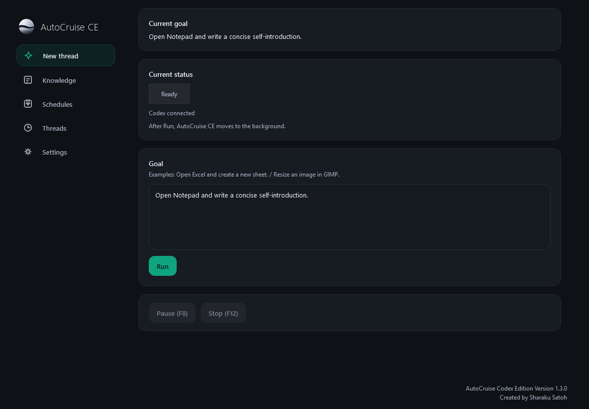

# AutoCruise CE

AutoCruise CE is a Windows desktop automation app powered by Codex App Server and ChatGPT sign-in. It observes the current desktop, asks Codex for the next action, executes through Windows automation and input backends, and continues until the task is complete or the user stops it.

Current source and packaged release version: `1.3.1`

The project is experimental. Verify important operations yourself before relying on the result in a real workflow.

## What It Does

- Runs natural-language desktop tasks on Windows.
- Uses Codex App Server as the only AI runtime in this edition.
- Uses `gpt-5.5` as the fixed Codex model.
- Prefers structured Windows automation, then direct Win32 input, optional browser adapters, and visual fallback.
- Supports manual runs, scheduled runs, pause/resume, stop, thread history, screenshots, and prompt profiles.
- Loads model context from the constitution, the selected system prompt, and custom instruction files.

## Portable Distribution

AutoCruise CE is distributed as a portable Windows package. There is no installer.

Download the latest portable archive from GitHub Releases:

- [AutoCruiseCE-portable-1.3.1.zip](https://github.com/sharakusatoh/autocruise/releases/download/v1.3.1/AutoCruiseCE-portable-1.3.1.zip)

To run it:

1. Extract the zip.
2. Open the extracted `AutoCruiseCE` folder.
3. Run `AutoCruiseSetup.exe` first if Node.js, npm, or Codex CLI is not already configured.
4. Run `AutoCruiseCE.exe`.

The app does not need to be installed. To remove it, close the app and delete the extracted folder.

## Requirements

- Windows 10 or Windows 11
- Codex CLI with `codex app-server`
- ChatGPT sign-in for Codex authentication

For normal users, `AutoCruiseSetup.exe` is the AutoCruise Bootstrapper. It can check the runtime, install Node.js LTS through winget, prepare Codex through `npx`, and launch AutoCruise CE.

Install Codex CLI:

```powershell
npm i -g @openai/codex@latest
```

AutoCruise CE checks `codex app-server` first. If it is not directly available, it can fall back to:

```powershell
npx -y @openai/codex@latest app-server
```

## Run From Source

Source development requires Python 3.12, PySide6, and Node.js/npm for Codex CLI.

```powershell
python -m pip install PySide6
python main.py
```

Open Settings, choose `Sign in with ChatGPT`, complete the browser sign-in flow, then return to AutoCruise CE and start a task.

## Basic Usage

1. Enter a goal in the main screen.
2. Start the run.
3. Let AutoCruise CE observe, plan, execute, and re-observe.
4. Use pause or stop when needed.
5. Review completed work in Threads and saved captures.

Default shortcuts:

- Pause / Resume: `F8`
- Stop: `F12`

Scheduled runs are supported through Windows Task Scheduler. The packaged app accepts:

```text
--run-task <task_id>
```

## Build Portable Release

Build the portable Windows package from source:

```powershell
build_windows.bat
```

This creates:

- `release\AutoCruiseCE\AutoCruiseCE.exe`
- `release\AutoCruiseCE\AutoCruiseSetup.exe`
- `release\AutoCruiseSetup.exe`
- `release\AutoCruiseCE-portable-1.3.1.zip`

`release/` is intentionally excluded from Git tracking. Publish the zip through GitHub Releases.

## Prompt Assets

Bundled prompt assets live in:

- `constitution/constitution.md`
- `users/default/systemprompt/`
- `users/default/user_custom_prompt.md`
- `users/default/custom_prompts/`

The Settings screen selects the active system prompt. AutoCruise CE passes that selected prompt into the planner instructions for each run.

Additional background on bundled system prompts:

- [sharakusatoh/systemprompt](https://github.com/sharakusatoh/systemprompt)

## UI Preview



## Repository Contents

- `src/`: application code
- `tests/`: automated tests
- `docs/`: architecture and release QA notes
- `constitution/`: default operating constitution
- `users/default/systemprompt/`: bundled system prompt profiles
- `users/default/custom_prompts/`: bundled custom instruction examples
- `build_windows.bat` and `AutoCruise.spec`: portable Windows packaging

The repository does not include runtime logs, screenshots, local preferences, local provider configuration, or packaged release output.

## Known Limitations

- AutoCruise CE is experimental and can fail on real desktop tasks.
- UI Automation coverage varies by app, control type, and rendering method.
- Drawing/canvas-heavy apps may require vision fallback and can be less reliable than standard controls.
- Browser automation through Playwright/CDP is optional and depends on an available connected browser context.
- Japanese input, IME behavior, and coordinate-sensitive operations vary by application and environment.
- Release packaging is Windows-only in this edition.

## Testing

```powershell
python -m unittest discover -s tests -v
```

## License

AutoCruise CE is released under the [MIT License](LICENSE).
