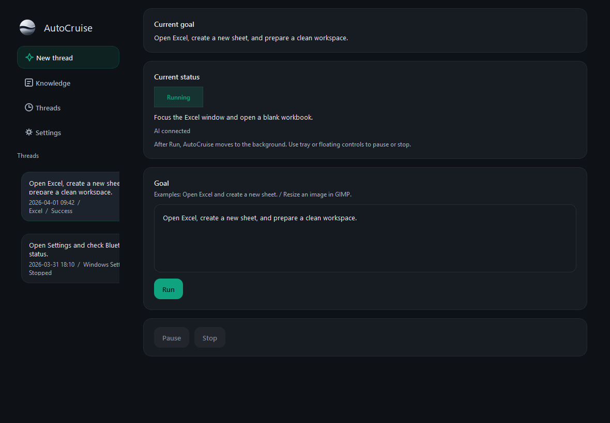

# AutoCruise CE

`autocruise` is the source repository for AutoCruise. At this stage, **AutoCruise CE** is the main implementation in the repository.

Current source and packaged release version: `1.1.0`

AutoCruise CE is an experimental, early-stage Windows desktop operator built around Codex App Server and ChatGPT sign-in. It observes the current desktop, uses structured Windows automation where available, plans the next action, executes mouse and keyboard input, and iterates until the task completes or the run stops.

This project is published under the MIT License.

Use it at your own risk. Please verify important operations yourself before relying on the result in a real workflow. The author does not promise complete compatibility or hands-on support for every Windows environment.

## Overview

- Windows desktop operator focused on AutoCruise CE
- Codex App Server with ChatGPT sign-in as the only AI runtime path in this edition
- Structured automation first: UIA -> Win32 input -> optional Playwright/CDP -> vision fallback
- Desktop-oriented UI built with PySide6
- Manual and scheduled execution support
- Prompt, app knowledge, and task template files stored as plain text assets

## Repository Scope

This repository is named `autocruise` so future editions or variants can live in the same source tree. For now, AutoCruise CE is the primary product in the repository.

Packaged Windows binaries are intended for GitHub Releases, not for the source tree itself.

## Requirements

### Runtime

- Windows 10 or Windows 11
- A Codex CLI installation that provides `codex app-server`
- ChatGPT sign-in for Codex authentication

### From source

- Python 3.12
- `PySide6`
- Node.js / npm for Codex CLI

## Setup

### 1. Install Codex CLI

```powershell
npm i -g @openai/codex@latest
```

AutoCruise CE checks `codex app-server` first. If it is not directly available, it can fall back to:

```powershell
npx -y @openai/codex@latest app-server
```

### 2. Run from source

```powershell
python -m pip install PySide6
python main.py
```

### 3. Sign in

1. Open `Settings`
2. Choose `Sign in with ChatGPT`
3. Complete the browser sign-in flow
4. Return to AutoCruise CE and start a task

## Basic Usage

1. Enter a goal in the main screen.
2. Start the run.
3. Let AutoCruise CE observe, plan, and execute the next step.
4. Use pause or stop when needed.
5. Review the result in the thread history and saved captures when applicable.

Default shortcuts:

- Pause / Resume: `F8`
- Stop: `F12`

Scheduled runs are supported through Windows Task Scheduler. The packaged app accepts:

`--run-task <task_id>`

## Build

To build the Windows package from source:

```powershell
build_windows.bat
```

This produces the packaged output under `release/`. Those build artifacts are intentionally excluded from Git tracking and should be distributed through GitHub Releases.

The packaged executable is:

`release\AutoCruiseCE\AutoCruiseCE.exe`

Typical release outputs:

- unpacked app folder under `release\AutoCruiseCE\`
- portable archive under `release\AutoCruiseCE-portable-<version>.zip`
- installer output when Inno Setup is available

## Latest Release Notes

- `1.1.0`: shifted AutoCruise CE further toward model-led planning by thinning editor-specific fallback rules, adding generic repeat guards, preserving explicit text-entry fallback, and refining the compact floating window header balance.
- `1.0.3`: reduced hardcoded filler behavior around text-authoring tasks, improved stop and shutdown handling, and tightened Notepad/editor completion logic so successful text entry stops instead of repeating.
- `1.0.2`: expanded direct process launch preference for known Windows apps before falling back to Run or Search, reducing launcher-related friction on common desktop tasks.

## UI Preview



## Included Prompt Assets

The repository includes default constitution, app knowledge, task templates, and system prompt assets used by AutoCruise CE.

Additional background on the bundled system prompts is available here:

- [sharakusatoh/systemprompt](https://github.com/sharakusatoh/systemprompt)

## Known Limitations

- AutoCruise CE is still experimental and may fail on real-world desktop tasks.
- UI Automation coverage varies by application, control type, and rendering method.
- Canvas-heavy software such as drawing tools may still require vision fallback and can be less reliable than standard controls.
- Browser automation through Playwright/CDP is optional and depends on an available connected browser context.
- Japanese input, IME behavior, and coordinate-sensitive operations can vary by application and environment.
- Release packaging is Windows-focused. Other platforms are not supported in this edition.

## Repository Contents

The source repository includes:

- `src/` for the application code
- `tests/` for automated tests
- `docs/` for architecture, prompt library, and release QA notes
- `apps/`, `tasks/`, `constitution/`, and `users/default/systemprompt/` for bundled knowledge and prompt assets
- `build_windows.bat` and `AutoCruise.spec` for Windows packaging

The source repository does not include:

- runtime logs
- screenshots
- local preference files
- local provider configuration
- packaged release folders or portable archives

## Testing

```powershell
python -m unittest discover -s tests -v
```

## License

AutoCruise CE is released under the [MIT License](LICENSE).
